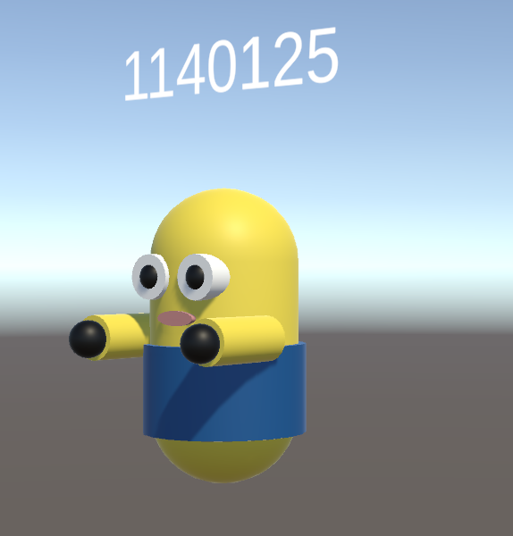

# Unity 미니 로봇 프로젝트
> 처음 써보는 Unity와 C#

### 참고
[Unity 강의](https://www.youtube.com/watch?v=MeHUEKGZQko&list=PLC2Tit6NyVieQ6vVq9HX9zEJKjPZ8QNcn&index=1)

[Unity 설치](https://toward-the-future.tistory.com/entry/Unity-Toturial-Unity-Essentials-Pathway-%EC%9C%A0%EB%8B%88%ED%8B%B0-%EB%8B%A4%EC%9A%B4%EB%A1%9C%EB%93%9C-%EB%B0%8F-%EC%84%A4%EC%B9%98%ED%95%98%EA%B8%B0-for-WindowsMacOS)

[Material 색상](https://acredev.tistory.com/17)

[TextMeshPro 아이콘 제거](https://littlecandle.co.kr/bbs/board.php?bo_table=codingnote&wr_id=282)

[Unity 프리팹 prefab](https://ugames.tistory.com/entry/%EC%8B%A4%EC%8A%B5%EC%9C%BC%EB%A1%9C-%EB%B0%B0%EC%9A%B0%EB%8A%94-%EC%9C%A0%EB%8B%88%ED%8B%B0-%EA%B8%B0%EC%B4%88-%ED%94%84%EB%A6%AC%ED%8C%B9-Prefab)

[Unity 빌드](https://dev-damdam.tistory.com/6)

 

## 기능 상세
### 1. Capsule Collider, Cube Collider, Cylinder Collider 를 이용하여 미니 로봇 형태 만들기

### 2. Material로 색상 입히기
### 3. UI 캔버스로 임의의 숫자 출력
### 4. 이동 구현

#### 4-1. 왼쪽 방향키를 누를 경우, Y축을 중심으로 반시계 방향으로 로봇 회전

#### 4-2. 오른쪽 방향키를 누를 경우, Y축을 중심으로 시계 방향으로 로봇 회전

#### 4-3. 위쪽 방향키를 누를 경우, Z축을 중심으로 전진

#### 4-4. 아래쪽 방향키를 누를 경우, Z축을 중심으로 후진

 

## 실행 결과
